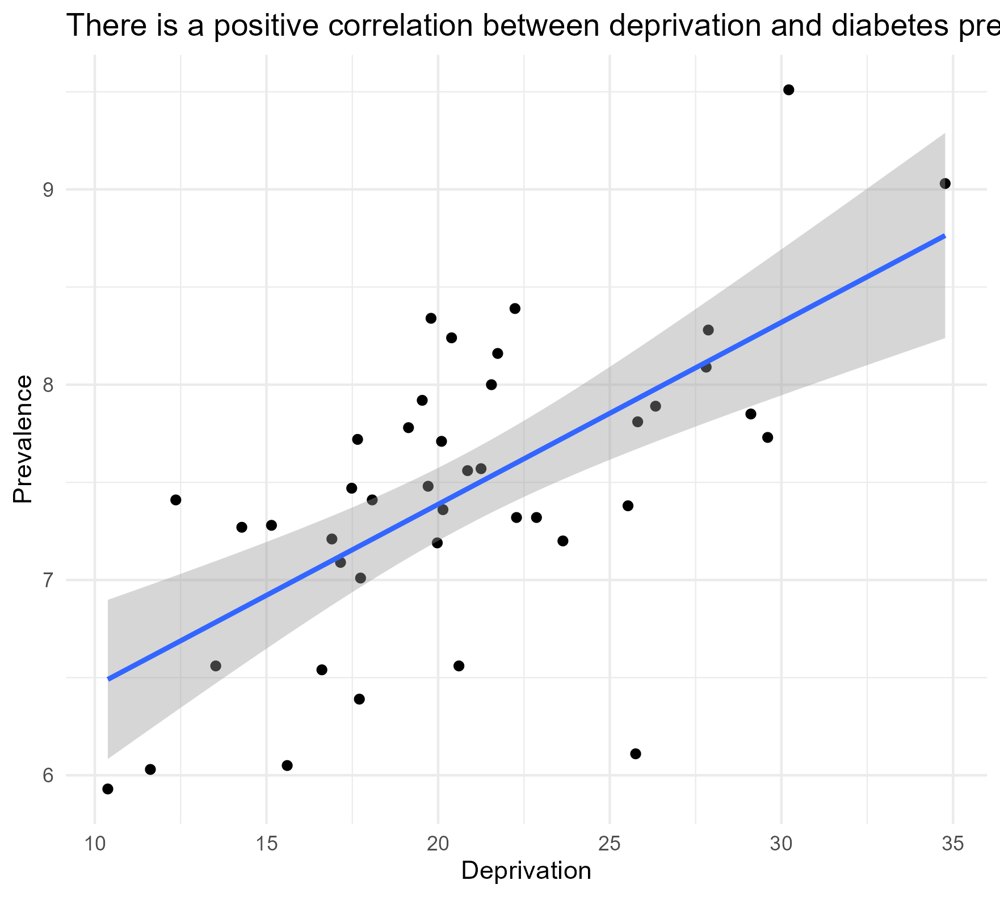
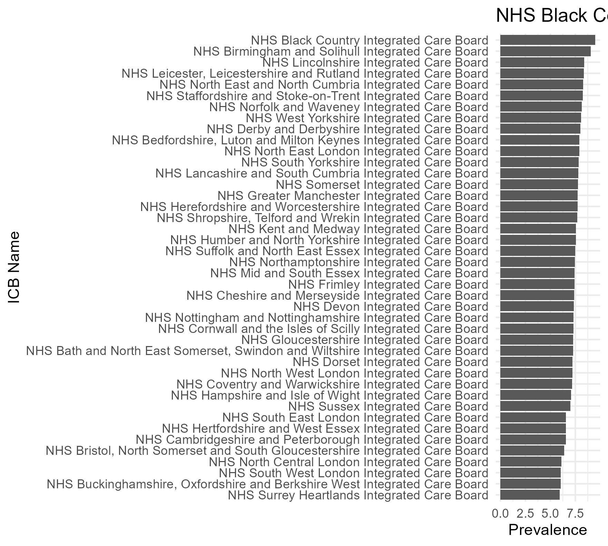

# Deprivation and Diabetes Prevalence Analysis across NHS ICBs

## Project Summary
This project analyses the correlation between deprivation and diabetes in England using Integrated Care Board (ICB) level data from NHS Digital website. This analysis indicates that there is a strong positive correlation between deprivation and diabetes.

## Research Question
What is the correlation between deprivation level in England and the prevalence of diabetes?

## Data Sources
- NHS Quality and Outcomes Framework (QOF) 2023-24 - Diabetes mellitus prevalence at ICB level. Published by NHS England. Available at: https://digital.nhs.uk/data-and-information/publications/statistical/quality-and-outcomes-framework-achievement-prevalence-and-exceptions-data/2023-24
- English Indices of Deprivation 2025 - IMD average score at Integrated Care Board level. Published by the Ministry of Housing, Communities & Local Government. Available at: https://www.gov.uk/government/statistics/english-indices-of-deprivation-2025

## Methods
Data from NHS was downloaded from NHS Digital website. Columns of data which were not needed were deleted and both files saved separately as CSV documents. The files were imported into R and some data was transformed such as removing extra spaces and making sure all ICB names matched before merging. Correlation coefficient was calculated and a scatter plot was generated. A bar chart was visualised to show the different levels of diabetes prevalence across all ICB boards in England.

## Key Findings
- Diabetes is strongly correlated with deprivation with a correlation coefficient of 0.65 (p-value < 0.001).
- NHS Black Country ICB had the highest prevalence of diabetes in England.

## Visualisations

## Tools Used
Excel - Data cleaning.
R - Data cleaning, data transformation and visualisation using ggplot2
tidyverse - data cleaning and transformation of NHS dataset

## Files in this Repository
- `Diabetes v deprivation.Rmd` — full R script for data cleaning and visualisation
- `deprivation_correlation.png` — scatterplot showing the correlation between deprivation and diabetes.
- `diabetes_prevalence.png` — bar chart showing the ICBs with the highest to lowest prevalence of diabetes in England.

